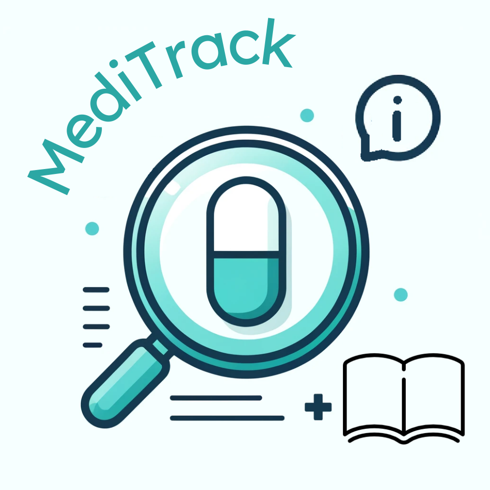

#  MediTrack: The Antidote to Knowing Your Medicines!

## Problem Statement

Have you ever struggled to remember the purpose of a medicine you own? Now imagine people who live alone, juggling multiple tasks, and often forgetting to monitor their medicines. In the **United States alone**, there are:

- **131 million** people using prescription drugs.  
- **35% of the population over 50 years old**, with **75% taking medication** and **27% living alone**.  

Studies reveal that **50% of people** struggle with taking, remembering, and understanding their medications.  
Failing to manage medications properly can lead to:
- **Disorganization** and poor adherence to prescriptions.  
- **Worsening of ailments** due to missed or incorrect doses.  
- **Unnecessary medical waste** and expenses from purchasing duplicate or alternative medications.  

---

## [Introducing MediTrack](https://youtu.be/FPTDmBH5EZg)

MediTrack is an **all-in-one free medicine tracker** designed to make managing your medications **simple and efficient**. It helps you understand the purpose of each medicine, answers health-related questions, and ensures **proper disposal** of expired medications.  

MediTrack offers **four main features**:

1. **MediScan**: Uses **computer vision** (OCR) to digitize your medicine inventory from photos.  
   - **How it works**: Take a photo of your medicine, receive detailed information, and store it in your **MediCatalog**.  

2. **MediCatalog**: Stores all your medicine data in one place.  
   - Access, edit, or remove entries anytime to stay organized.  

3. **MedInfo**: Provides **home remedies** and interesting **medical facts**.  

4. **MediBot**: A **custom GPT-powered bot** to answer any health-related questions.  
   - Though not a substitute for professional medical advice, it helps **save time and effort** when searching for answers.

---

## Why I Created MediTrack

During the pandemic, my parents stocked up on medicines to prepare for emergencies. Recently, I saw them struggle to remember what each medicine was for and whether it was safe to use. This experience made me wonder how people living alone, especially seniors, manage their medications.  

After speaking with members of my community, I found that **many seniors lacked the energy and resources** to organize their medicines or search for their purposes. Quantitative research confirmed that **50% of people** struggle with medication management. The consequences of poor medication management are significant:  
- **Worsening health conditions** from missed doses.  
- **Medical waste** from unnecessary purchases.

Realizing the **scope of this issue**, I brainstormed a solution that would be **accessible, authentic, and easy to use**—and **MediTrack** was born! Technology was the perfect tool to help people **store and access medication information** effortlessly.

---

## Development Journey

Developing MediTrack was a **challenging yet rewarding journey**. I experimented with several technologies to find the most suitable for my prototype. Python was ideal due to its:
- **pytesseract** library for Optical Character Recognition (OCR).
- **OpenCV2** for image processing to enhance OCR accuracy.
- **Data management** capabilities and web browsing features.
- Suitability for **prototyping** with **tkinter** for visualizing the UI.

**Visual Studio Code** was my IDE of choice, and I’ve already started developing the app with **React Native** for better scalability and UI. Some challenges I faced included:
- Finding the right libraries to meet my needs.  
- Configuring OpenCV2 to optimize image settings for OCR.  
- Learning how to implement pytesseract effectively.  
- Developing each screen’s functions and managing user data with CSV files.  
- Setting up and configuring a **custom GPT** (MediBot).  

Despite the **steep learning curve** and tight timelines, the experience was incredibly rewarding. I not only **learned new technologies** but also **developed a solution** that can impact real-world problems.

---

## Future Plans

I have several exciting goals for MediTrack’s future development:

- **Transition to React Native** for cross-platform support, better UI, and enhanced UX.
- Provide **multilingual support** to reach a wider audience.
- Allow users to **customize colors and fonts** for accessibility.
- Add functionality to **share MediData with doctors or caregivers**.
- Integrate **other health-related metrics** or information users want to track.
- Develop a **notification system** for medication reminders.
- Add a **medicine search feature** for quick access to information.
- Improve security with **data encryption**.
- Expand **MedInfo** with more content.
- Add more details (e.g., dosage requirements) to scanned medicines.
- Enhance OCR capabilities and use APIs instead of Google searches to gather medicine information.

---

## Conclusion

MediTrack is **just the beginning** of a much larger vision to revolutionize how people manage their medicines. I believe it can **improve healthcare access**, **reduce medication waste**, and **empower users** to take control of their health. I’m excited to continue developing MediTrack and **bring my vision to life**.

MediTrack: The Antidote to Knowing Your Medicines!
